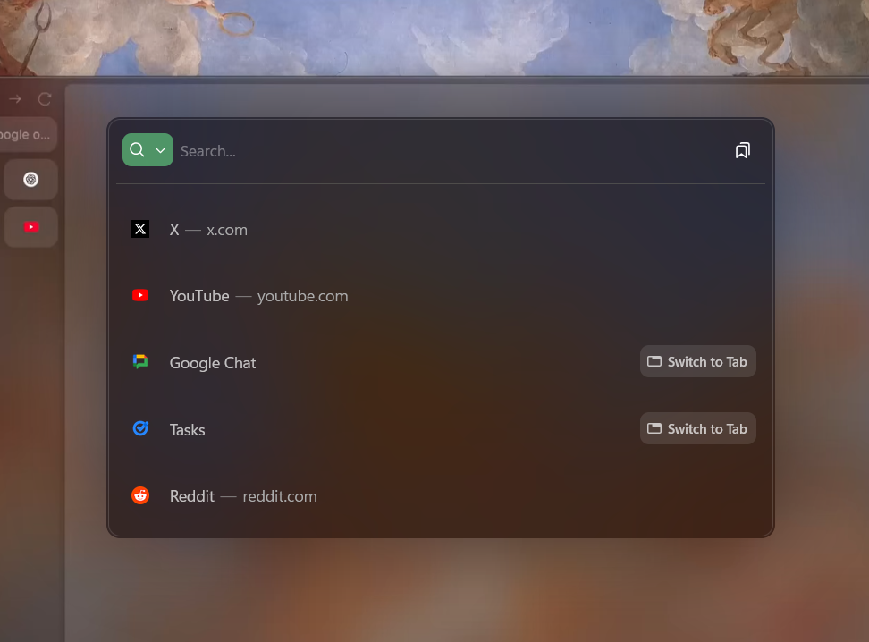

# Better Urlbar

This mod makes the urlbar look better similar to the one in Arc Browser.

**Note**: `browser.urlbar.scotchBonnet.enableOverride` has to be enabled in `about:config` for this to work as shown in the image.

